# Average Sized Datasets

The smaller datasets includes Medicare Quarterly Part B, Medicare Quarterly Part D, Medicare Part B, Medicare Part D, and Medicare Part B Discarded Units. 

## NA Values

In the Medicare Quarterly Part D Datasets, the Total Beneficiaries column and the Average Spending Per Beneficiaries columns had lots of NA values present. 

In the Medicare Quarterly Part B datasets, missing information included Gnrc_Name identifier name for the drug, Total Beneficiaries, and Average Spending Per Beneficiaries. 
When I conduct my analysis, I will need to research on why information about beneficiaries is excluded from the dataset. 

I found a significant amount of missing information for a good amount of drugs in the Medicare Part B and Medicare Part D Datasets. I have included tables of the total NA counts for drugs that have NA values present in the dataset. 
I also included a column called "Missing Information" that tells you which pieces of data are missing for every drug record. This will be useful for further analysis. 

## Histogram Visualizations

**Medicare Quarterly Part D Histograms**

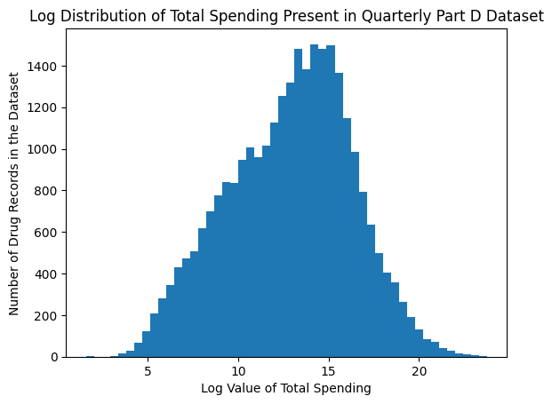

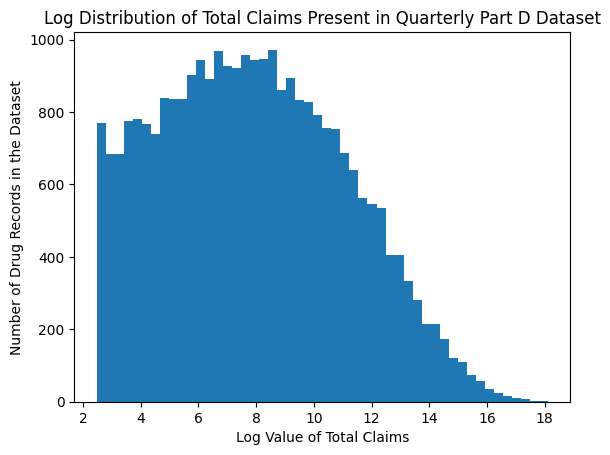

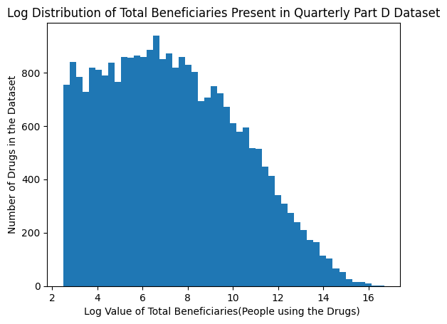

**Medicare Quarterly Part B Histograms**

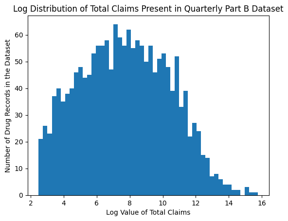

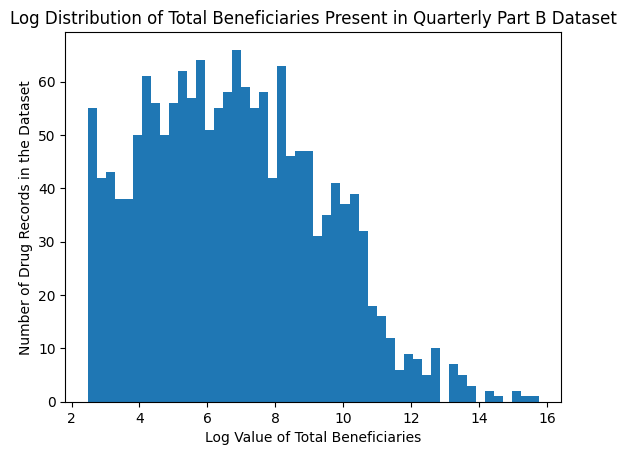

**Medicare Part D Histograms by Year** 

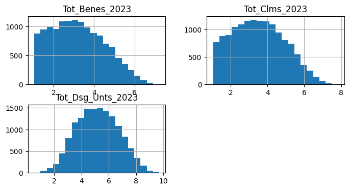

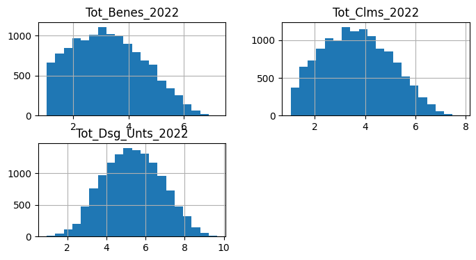

**Medicare Part B Histograms by Year**

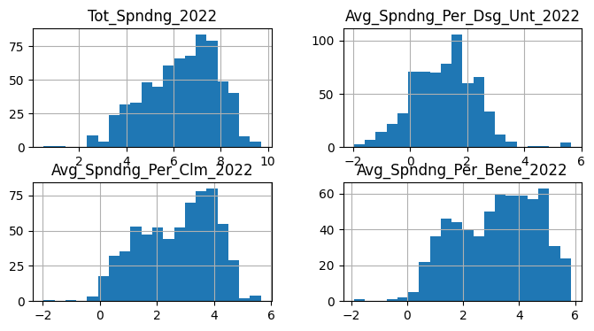

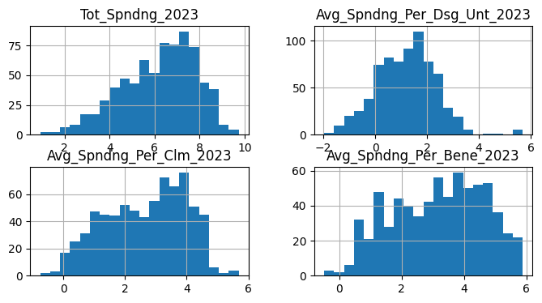

# Larger Sized Datasets

The larger sized datasets that were loaded in includes the Medicare 2023 Physician & Other Practicioner Dataset and the Medicare 2022 Physician & Other Practicioner Dataset. 

## Preprocessing

To preprocess the files, I used a SQL statement within a Duck DB connection to read the csv files into parquet files. My goal was to be able to query from the parquet files for analysis. 

## Data Exploration 

For the files from different years, I did some basic data exploration to familiarize myself with the datasets. 

First, I queried to find the unique medical providers and the unique medical services. 

Next, I for each year, I found the top 10 most expensive medical services along with the number of beneficiaries who pursued those services. 

I then wanted to see if I could find which medical services were most commonly seeked, and I calculated the total number of beneficiaries for every grouping of HCPCS code. 

Below, initial data tables from the year of 2022 are displayed. 

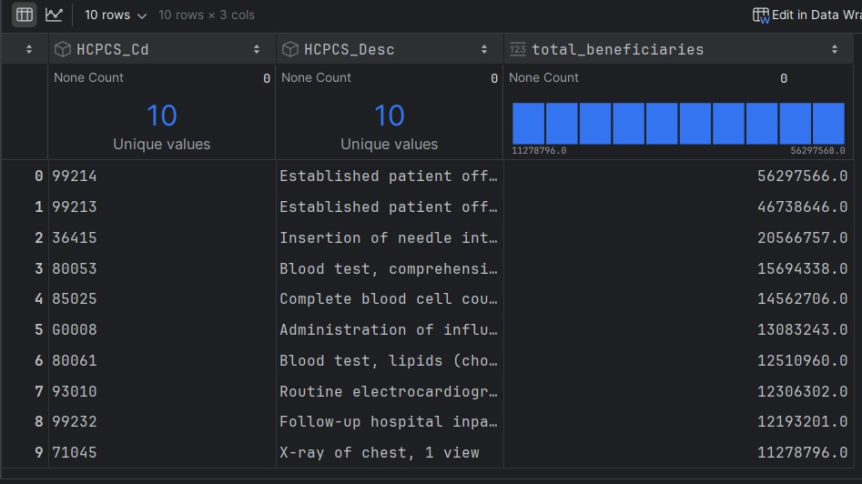

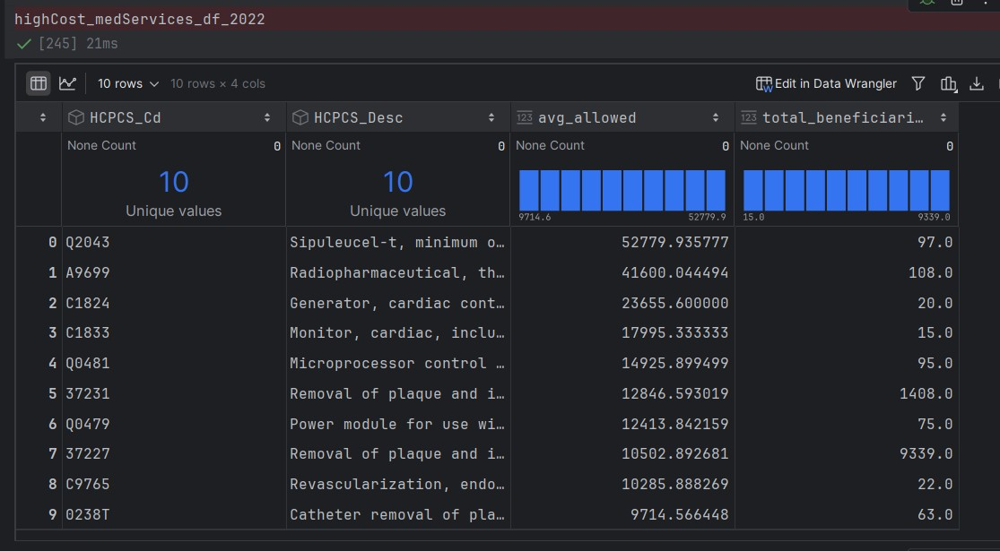
