# Introduction:

## Background Context:

**Personal Relevance:** 

My family has a history of various medical conditions and diseases, including: 
* Breast Cancer 
* Heart Disease 
* Parkinson's Disease
* Thyroid Disorders

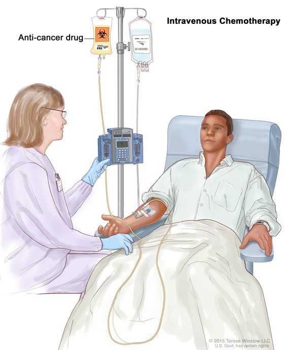

I was curious on whether individuals who deal with different medical conditions receive significantly different amounts of insurance funding for medical services and drugs involved in treatment. 

**Medicare:** 

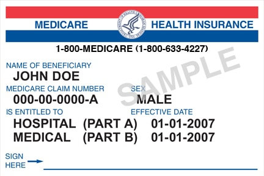

This analysis primarily focuses on Medicare health insurance. 
Medicare is a health insurance program in the United States that serves adults that are at least 65 years of age, younger people with disabilities, and people with specific serious medical conditions. Medicare is run by the Centers for Medicare and Medicaid Services. 

The ultimate goal of this analysis is to explore whether insurance coverage from Medicare differs significantly among different medical drugs and different medical services used for treatment of illnesses.

## Dataset Information and Insurance Vocabulary

### <u>Website Containing Datasets:</u>

The datasets used in this analysis were found on the data.CMS.gov website. This website provides access to health care datasets that are related to Medicare and Medicaid insurance programs. 

### <u>Dataset Information:</u>

The original datasets that were used for this analysis includes: 

o	**Medicare Quarterly Part B Spending by Drug** – Provides Quarterly summary information on Medicare Spending on Part B drugs. 

o	**Medicare Quarterly Part D Spending by Drug** - Provides Quarterly summary information on Medicare Spending on Part D drugs.

o	**Medicare Part B Spending by Drug** - Provides Annual summary information on Medicare Spending on Part B drugs.

o	**Medicare Part D Spending by Drug** - Provides Annual summary information on Medicare Spending on Part D drugs.

o	**Medicare Part B Discarded Drug Units** – Provides information on the number of discarded Part B drug units, and the amount of money Medicare spends on those discarded Part B drug units. Summarizes Medicare’s drug spending on wasted drug products that were not administered to patient. 

o	**Medicare, Physician, & Other Practitioners By Provider and Service** – Contains Information regarding medical services provided by providers and Medicare coverage for different Medical Services.

### <u>Insurance Vocabulary:</u>

Part B and Part D Drugs were primarily analyzed: 

	**Part B Drug**: Drugs that are administered in medical settings. These medical settings include doctors’ offices, hospitals, clinics, and other medical facilities. 

	**Part D Drug**:  Prescription drugs that are administered outside of medical settings. These drugs are typically taken in people’s homes. 

	**Beneficiary**: A person who is enrolled under Medicare insurance to receive insurance payment coverage from Medicare on Medical Services and Prescription Drugs. 

	**Service**: A health care or medical procedure offered to patients by a provider that is billed to insurance. Examples of this includes surgeries, drug administration, lab tests, physician examinations, routinely checkups. 

	**Provider**: A medical worker that performs medical procedures. 

	**Claim**: A health care provider submits a billing record to the insurance program requesting payment for service or drug provided to beneficiary. These records include information on the service provided, beneficiary who received the service, and the amount of money charged for the service. 

	**Medicare Reimbursement**: The amount of money that the Center for Medicare and Medicaid services pay a healthcare provider for providing a medical service to a beneficiary. 

## My Hypothesis

<u>**Part B vs.Part D Drug Medical Reimbursement Hypothesis**</u>

* Medicare provides higher reimbursement for drugs classified under Part B compared to drugs classified under Part D. Part B drugs are typically administered under medical supervision. Additional factors such as drug wastage during administration and the complexity of treatment delivery may also contribute to higher reimbursement amounts. 

<u>**Medicare Reimbursement Amounts for Medical Services Hypothesis**</u>

* Medicare Reimbursement amounts vary based on the type of Medical Service that was provided and the state in which the Medical Service was delivered. 

# Feature Engineering

2 New Tables were created from the **Medicare Physician, Other Practitioners By Providers and Service** dataset. 
One table was created for the year of 2023, and another table was created for the year of 2022. 

These tables are called "Medicare Weighted Average Payment by State". These tables serve the purpose of recording the estimated weighted average amount of medicare dollars that are contributed to the top 50 most common services, per state. 

A description of the variables present in this feature engineered dataset is provided below: 

•	HCPCS_cd: Unique code identifying the service that was provided. 

•	Rndrng_Prvdr_State_Abrvtn: State where the service was provided.  

•	est_wght_avg_Mdcr_paid: The weighted average Medicare payment for one occurrence of an HCPCS service within a state, calculated by weighting provider-level Medicare payments by total service volume.   

# Machine Learning

Linear Regression and K-means Clustering were applied to the engineered "Medicare Weighted Average Payment By State" datasets to examine how medical service type, provider state, and total services contribute to variation in Medicare reimbursement. 

## Linear Regression 

Three linear regression models were fit using the feature engineered "Medicare Weighted Average Payment by State" dataset to examine whether Medical Service Type, Provider State, and Total Service Volume explain differences in Weighted Average Medicare Payment Per Service. Comparing these models helps identify which factors have the strongest influence on Medicare Reimbursement.

### Year 2023: 

#### Model 1: 
<u>Feature Set:</u> Medical Service Type (HCPCS) +  Provider State + Total Service Volume

<u>R-Squared Coefficient:</u>  0.79966
#### Model 2:
<u>Feature Set</u> Medical Service Type (HCPCS) + Provider State

<u>R-Squared Coefficient: </u> 0.79928
#### Model 3 
<u>Feature Set:</u> Medical Service Type (HCPCS)

<u>R-Squared Coefficient: </u> 0.786

**_2023 Linear Regression Analysis:_** 78.6% of variation in Weighted Average Medicare Payment contribution is explained by Medical Service Type (HCPCS). The Provider State and the Total Service Volume only contribute to approximately 1% more of the variation in Weighted Average Medicare Payment when added as predictor features along with Medical Service Type (HCPCS). This suggests that the majority of the variation in Weighted Average Medicare Payment is explained by Medicare Service Type (HCPCS Code).

### Year 2022: 

#### Model 1: 
<u>Feature Set:</u> Medical Service Type (HCPCS Code) + Provider State + Total Services

<u>R-Squared Coefficient:</u>  0.9719
#### Model 2:
<u>Feature Set</u> Medical Service Type (HCPCS Code) + Provider State

<u>R-Squared Coefficient: </u> 0.9719
#### Model 3 
<u>Feature Set:</u> Medical Service Type (HCPCS Code)

<u>R-Squared Coefficient: </u> 0.96048

**_2022 Linear Regression Analysis:_** 96.048 % of variation in Weighted Average Medicare Payment Contribution is explained by Medical Service Type (HCPCS Code) alone. When the Provider State and Total Service Volume are added as predictor features, R Squared value increases by only 1 percentage point, indicating that HCPCS code accounts for the vast majority of variation in Medical reimbursement. This suggests that service type primarily determines the amount of weighted medicare payment. 

### **_Overall Linear Regression Analysis:_** 
Across both the 2022 and 2023 "Medicare Weighted Average Payment by State" data tables, Medical Service Type (HCPCS Code) explains the greatest proportion of variation in weighted Medicare payment per service. Provider State contributes a small initial amount of explanatory power, while total service volume contributes very little once service type is already included. These findings suggest that Medicare reimbursement is driven primarily by the type of service performed rather than utilization volume.  

Therefore, the hypothesis that Medicare Reimbursement varies by Medical Service is supported. However, the hypothesis that Medicare Reimbursement varies by State is not supported. 

## K Means Clustering

K means clustering is an unsupervised machine learning method used to group observations with similar values into clusters. 
For this analysis, I created datasets for the years of 2022 and 2023 by calculating the mean weighted Medicare payments for each unique HCPCS medical service within the top 50 most frequent HCPCS services. 
K Means Clustering was then applied to identify payment groupings based on average Medicare payment per service.  

To determine the optimal number of clusters (k), silhouette scores were computed for k ranging from values of k = 2 to k = 20. 
In the 2022 data, k = 2 clusters produced the highest silhouette score, indicating two distinct payment clusters. 
In the 2023 data, k = 3 clusters produced the highest silhouette score, indicating three distinct payment clusters. 

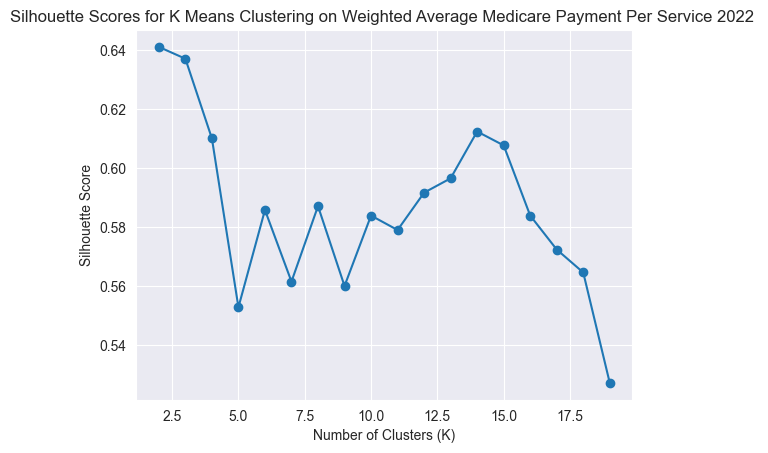

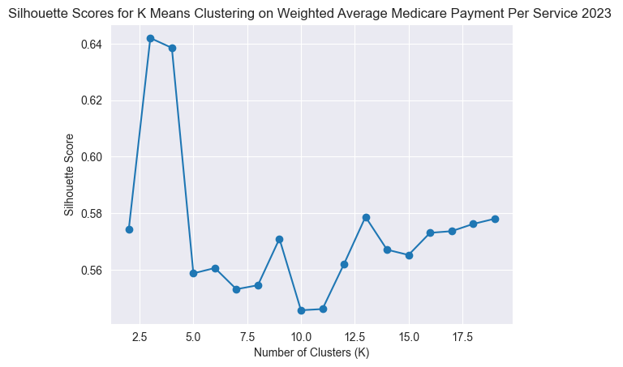

Next, I made BoxPlots for the 2022 and 2023 data to visualize the Weighted Average Amount of money medicare contributes towards services in clustered groups. 

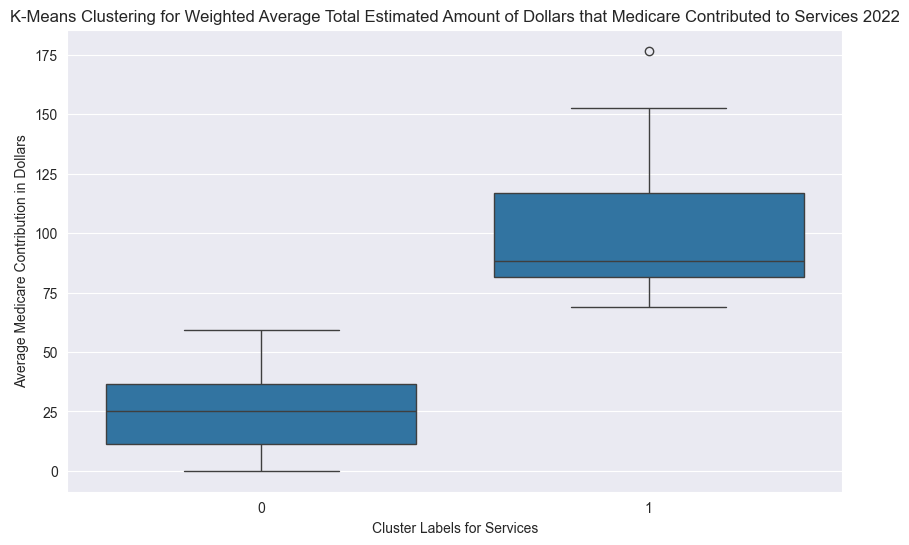

The 2022 boxplot shows two distinct payment clusters. Services in Cluster 1 have significantly higher average Medical payment values than services in Cluster 0, indicating that Medicare Reimbursement separates into lower payment and higher payment service groups. 

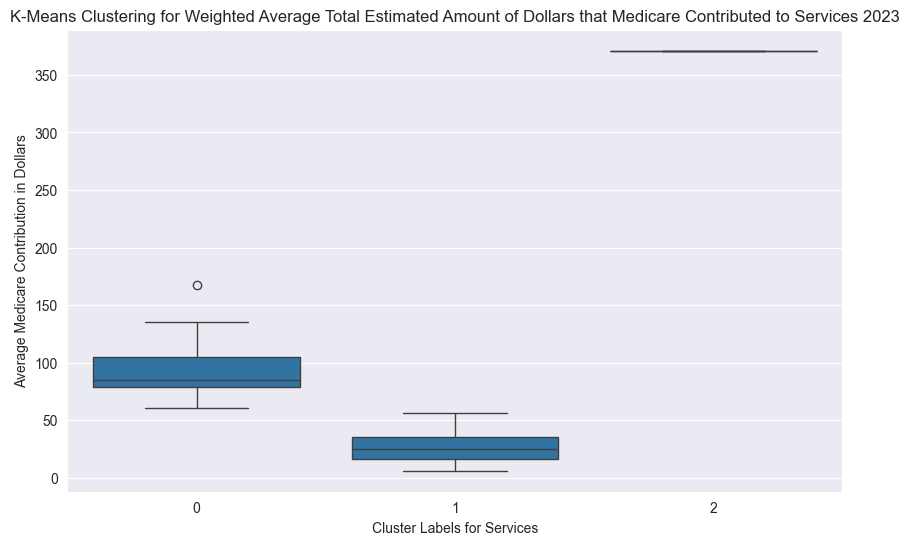

The 2023 boxplot shows three distinct payment clusters. Cluster 0 contains services with moderate payment levels, Cluster 1 contains lower payment services, and Cluster 2 contains a single high payment service that is separated from other groups due to its unusually large Medicare Payment Value. 

These clustering results support the hypothesis that Medicare Reimbursement differs meaningfully across medical service types, with some services consistently grouped into higher-payment categories than others. 

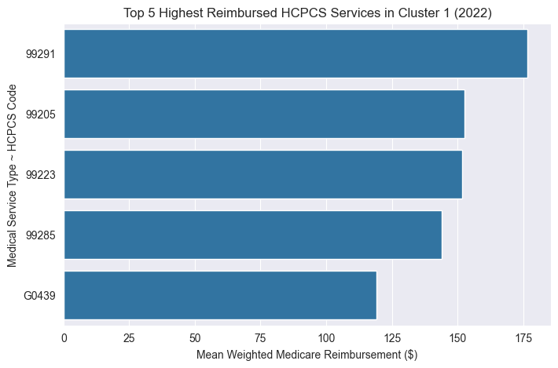

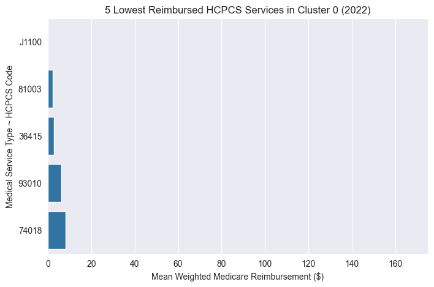

Additionally, the bar plots above illustrate a substantial contrast in mean weighted Medicare reimbursement between medical services classified in Cluster 1 and Cluster 0 for the year 2022. Services in Cluster 1 represent the highest reimbursement group while services in Cluster 0 represent the lowest reimbursement group. 

**The lowest reimbursement Medical Service Types (HCPCS Codes) includes:** 

* <U>J1100:</u> Steroid medication injection.  
* <U>81003:</u> Urinalysis: A diagnostic urine test. 
* <U>36415:</u> Standard blood draw to collect blood from patient. 
* <U>93010:</u> EKG interpretation and report.  
* <U>74018:</u> Abdominal x-ray. 

**The highest reimbursement Medical Service Types (HCPCS Codes) includes:** 

* <U>99291:</u> Critical care evaluation and management
* <U>99205:</u> New patient office visit 
* <U>99223:</u> Initial hospital inpatient care
* <U>99285:</u> Emergency department visit   
* <U>G0439:</u> Annual wellness visit 

A clear pattern across these services is that lower Medicare reimbursement is associated with routine laboratory and diagnostic procedures, whereas higher Medicare reimbursement is associated with more complex physician-managed services that require greater clinical time, decision-making, and documentation. 

## Comparing Medicare Spending between Part B and Part D Drugs

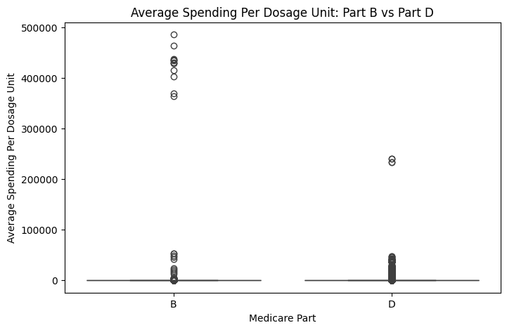
Figure 1.3 

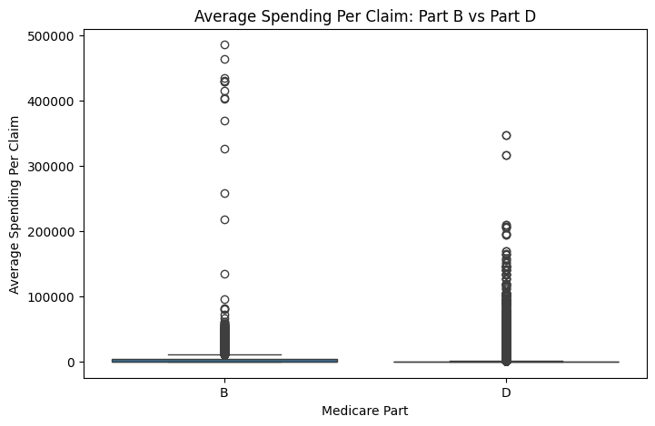
Figure 1.4

The boxplots above compare the spending distributions between Medicare Part B and Medicare Part D drugs.
For context, Part B drugs are typically administered to patients by healthcare professionals in clinical settings such as physician offices or hospitals, whereas Part D drugs are generally self administered by patients through prescriptions. 

Figure 1.3 presents the distribution of Medicare’s average spending per dosage unit, and Figure 1.4 presents the distribution of Medicare’s average spending per claim for Part B and Part D drugs. Both distributions are strongly right-skewed, indicating that most drugs have relatively lower spending values while a smaller number of drugs have exceptionally high spending values. 

Across both distributions, Part B Drugs exhibit higher maximum values and more extreme upper tail values compared to Part D drugs. The median spending for Part B is slightly higher than for Part D in both distributions, suggesting that Part B drugs tend to have greater reimbursement levels on average.  

These distributional differences are consistent with the hypothesis that Medicare reimbursement is generally higher for Part B drugs, potentially reflecting physician-administered delivery, clinical supervision requirements, and treatment complexity.   

## Part B Discarded Drug Units

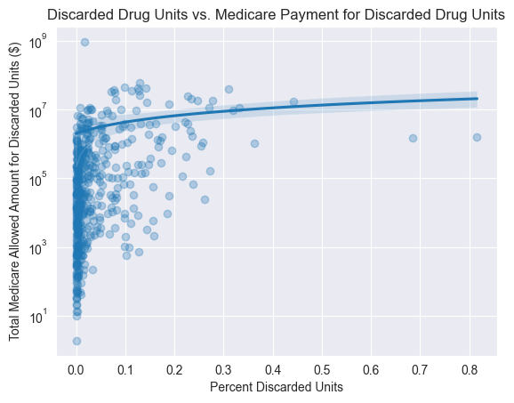

The scatterplot above shows the relationship between the Percent of Discarded Drug Units and the total Medicare payment associated with those discarded units. One key observation is that Medicare payment can vary substantially even when drugs have the same discarded unit percentage. In the dense cluster near very low discarded percentages, multiple drugs show very different discarded payment amounts, indiciating that similar levels of drug waste do not necessarily correspond to similar reimbursement amounts. This suggests that factors such as drug price and utilization also influence discarded Medicare spending. The regression line indicates a slight positive relationship between percent discarded drug units and total Medicare payment for discarded drug units, although the trend appears relatively weak due to the large amount of variability among the drugs.  

The discarded drug analysis visual provides partial support for the **Part B vs. Part D Drug Reimbursement Hypothesis**, as the scatterplot shows a slightly positive relationship between the discarded drug unit percentage and Medicare payment for discarded drug units, suggesting that drug wastage may contribute to higher reimbursement for some part B drugs. 

However, the wide variation in discarded payment at similar discarded percentages indicates that wastage alone does not fully explain reimbursement differences, and that drug price and utilization also likely influence Medicare spending. 

## Overall Findings From Analysis 

* Medical reimbursement varies strongly by HCPCS medical service type, but does not vary strongly by State where Medical Service was provided. 

* Part B Drugs generally show higher Medicare spending distributions that Part D drugs. 

* Part B Drug waste contributes somewhat to Medicare reimbursement, but does not fully explain variation in Medicare spending. 

