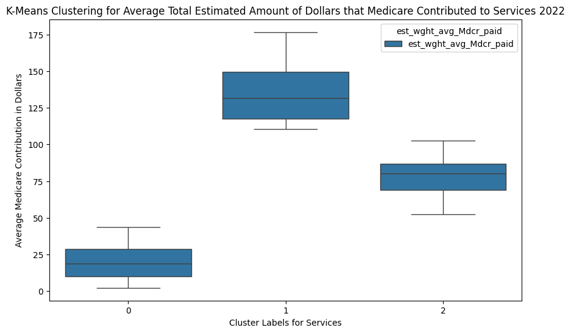
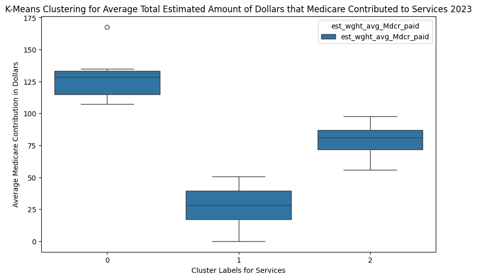
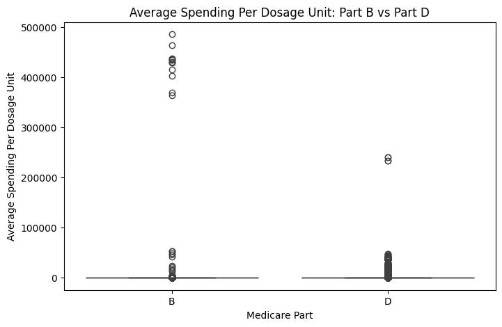
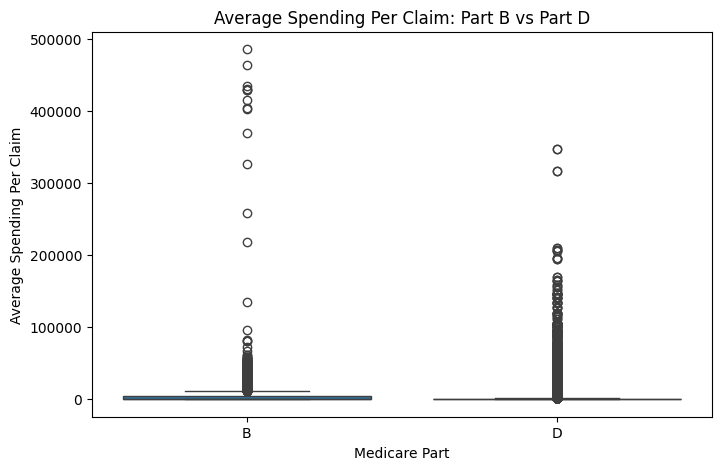

### I created a table (Medicare_totalPymt_by_State) with the following variables for 2022 and 2023 data: 

•	HCPCS_cd: tells you the service provided 

•	Rndrng_Prvdr_State_Abrvtn: state where the service was provided 

•	est_wght_avg_Mdcr_paid: among all providers in the state, gives the total estimated amount of dollars that medicare contributed to the service. 

•	The table basically gives the total estimated Medicare spending per service per state. 

<u>Machine Learning Technique Applied: </u>

Linear Regression applied to the top 50 services in the dataset (services that most beneficiaries receive). 

o	2023 ~ R Squared for model with predictors of Service and State: 0.955

o	2023 ~ R Squared for model with only predictor of Service: 0.939

o	2022 ~ R Squared for model with predictors of Service and State: 0.971

o	2022 ~ R Squared for model with only predictor of Service: 0.961 

<u>Analysis:</u> 
Above, the R Squared coefficients are displayed for linear Regression Models that include both Service & State, and only Service as predictor variables for the years of 2022 and 2023. Overall, the R Squared values were very high. When State was removed as a predictor variable, the R Squared coefficient value shrank a small amount. This indicates that Service explains the majority of variation in Medicare payment amounts. This essentially means that the type of medical procedure performed by the provider during the service determines the amount of money that Medicare pays for the service. 

This supports my hypothesis that Medicare payment coverage varies by service, but does not support my hypothesis that Medicare payment coverages strongly varies by state. 

<u>Machine Learning Technique Applied:</u> I grouped together the top 50 services and for each service I computed the average total estimated amount of money in dollars that Medicare contributed to the service. 
I then applied a K Means Clustering Algorithm on the average total amount of money that Medicare contributed to the services. Every unique service present in the dataset was essentially assigned a cluster. 

Figure 1.1

Figure 1.2

<u>Analysis:</u>  The large R Squared coefficient values from the Linear Regression models indicated that Service Type explains a lot of variation in Medicare Total Contribution Amounts. To further explore this structure, I applied K-Means clustering to the Average Total Medicare payment per service. 

The resulting box plots show clear separation into three distinct clusters corresponding to high, medium, and low payment contributions by Medicare. The centers and interquartile ranges are not overlapping on each other, which indicates that Total Medicare Payment amounts are grouped in three distinct categories of payment amounts.  
These findings line up with the Linear Regression results and provide additional evidence that service type is the main contributor of variation in Total Medicare Payment Amount. 

### Comparing Medicare Spending between Part B and Part D Drugs

Figure 1.3 

Figure 1.4

Distributions of spending between Medicare Part B and Medicare Part D drugs are displayed above. 
For context, part B drugs are administered to patients by medical professionals in doctors’ offices and hospitals. Part D drugs are administered by the patient at home. 
Figure 1.3 shows Medicare’s Average Spending Per Dosage Unit on Part B and D drugs. Figure 1.4 shows Medicare’s Average Spending Per Claim between Part B and Part D drugs. The average spending distributions are clearly right skewed for Part B drug. In both distributions, the maximum Average Spending Per Claim and the maximum Average Spending Per Dosage Unit is significantly higher for Part B than for Part D. Part B has high outliers as well, indicating that there are drugs that Medicare pays significantly high amount of money for. The median of the distribution of Part B is also slightly higher compared to the median of the distribution of Part D for both average spending variables. 

The distributions above provide evidence that Medicare provides more insurance coverage on Part B drugs than on Part D drugs, supporting my initial hypothesis. 

